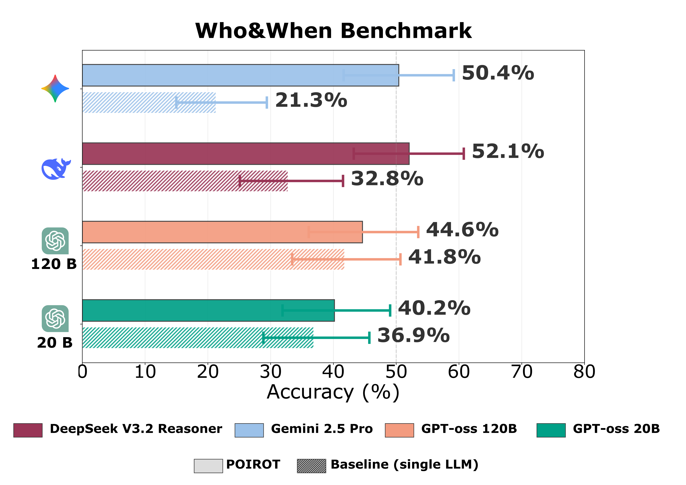

<p align="center">
  
</p>

# POIROT

**Automated forensic analysis for multi-agent AI systems.**

When a multi-agent system produces a wrong, dangerous, or unexpected output, the hardest question is: **which agent caused it?** In a system with multiple agents that all communicated with each other, tracing the root cause manually is slow, error-prone, and often impossible.

POIROT automates that investigation. You give it a description of your system and the conversation history of a failed session. It returns a structured forensic report identifying which component is responsible.

---

> **Preprint:** *(coming soon)*
>
> **Website:** *(coming soon)*
>
> **Documentation wiki:** [github.com/11inaki11/POIROT/wiki](https://github.com/11inaki11/POIROT/wiki)

---

## How it works

POIROT treats a failed session as a crime scene. It runs 4 sequential phases:

1. **Error Vector Space** — maps all possible failure sources in your system into a binary error space
2. **Individual Analysis** — each agent independently self-assesses its own behavior
3. **Peer Consultation** — agents interrogate each other via a LangGraph multi-agent graph
4. **Weighted Consensus** — votes are aggregated using a consistency-weighted formula to identify the faulty component

The result is an explainable, auditable forensic report — not a black-box prediction.

---

## Benchmark results

Evaluated on the **Who&When benchmark** — 122 heterogeneous multi-agent configurations each with a single injected fault spanning medical, financial, and software domains.

<p align="center">
  
</p>

POIROT consistently outperforms a single-LLM baseline across all four tested models. The advantage is largest on harder configurations: for Gemini 2.5 Pro, accuracy jumps from 21.3% (baseline) to 50.4% with POIROT — a **+136% relative gain**. DeepSeek goes from 32.8% to 52.1% (+59%). Even in the most competitive setting (GPT-oss 120B), POIROT adds +2.8 pp, and smaller models benefit most from the multi-agent protocol.

---

## Installation

```bash
pip install poirot-framework
```

Requires Python 3.10+.

---

## Quickstart

If your system is built with LangChain/LangGraph, pass your agents and their message histories directly — no database needed.

```python
from langchain_core.messages import HumanMessage, AIMessage, ToolMessage
from langchain_core.tools import tool
from langchain_google_genai import ChatGoogleGenerativeAI
from langgraph.prebuilt import create_react_agent

from poirot import run_poirot_from_agents, LangChainAgentAdapter

# 1. Define your tools
@tool
def search_web(query: str) -> str:
    """Search the web for information."""
    return "Results for: " + query

@tool
def summarize(text: str) -> str:
    """Summarize a block of text."""
    return "Summary: " + text[:80]

# 2. Create your agents
llm = ChatGoogleGenerativeAI(model="gemini-2.5-flash", api_key="YOUR_API_KEY")
researcher = create_react_agent(llm, tools=[search_web])
writer     = create_react_agent(llm, tools=[summarize])

# 3. Provide the message history from a failed session
researcher_messages = [
    HumanMessage(content="Find information about the Q3 earnings report."),
    AIMessage(content="Searching...", tool_calls=[{"name": "search_web", "args": {"query": "Q3 earnings"}, "id": "c1", "type": "tool_call"}]),
    ToolMessage(content="Q3 revenue: $4.2B, down 8% YoY.", tool_call_id="c1", name="search_web"),
    AIMessage(content="Handing off to WriterAgent."),  # BUG: omits the 8% decline
]

writer_messages = [
    HumanMessage(content="Q3 revenue was $4.2B.", name="researcher"),  # decline not mentioned
    AIMessage(content="Summary: Q3 revenue reached $4.2B, a strong quarter."),  # incorrect framing
]

# 4. Run POIROT
results = run_poirot_from_agents(
    agents=[
        LangChainAgentAdapter(agent=researcher, messages=researcher_messages, agent_id="researcher", agent_name="ResearcherAgent"),
        LangChainAgentAdapter(agent=writer,     messages=writer_messages,     agent_id="writer",     agent_name="WriterAgent"),
    ],
    system_name="ResearchPipeline",
    system_description="""
        Two-agent research pipeline:
        - ResearcherAgent: searches the web and summarizes findings for WriterAgent
        - WriterAgent: receives the summary and produces the final report
    """,
    provider="gemini",
    model="gemini-2.5-pro",
    api_key="YOUR_API_KEY",
)

# 5. Read the verdict
c = results["consensus"]
if c["is_tie"]:
    print(f"TIE between     : {', '.join(c['tied_components'])}")
else:
    print(f"Faulty component: {c['faulty_component']}")
print(f"Confidence      : {c['confidence_pct']:.1f}%")
```

**Not using LangChain?** If your agents are built with a different framework or in-house, log their messages to a SQLite database and use `run_poirot()` instead — it works with any system, any language. See the [database integration guide](https://github.com/11inaki11/POIROT/wiki/Integration-Database).

---

## Supported LLM providers

| Provider | `provider=` value |
| --- | --- |
| Google Gemini | `"gemini"` |
| OpenAI | `"openai"` |
| DeepSeek | `"deepseek"` |
| Ollama (local) | `"ollama"` |
| LM Studio (local) | `"local"` |

---

## Reading the results

```python
results = poirot.run_poirot(...)

# Main verdict
c = results["consensus"]
c["faulty_component"]   # "RiskManagerAgent" — or "AgentA / AgentB" if tied
c["confidence_pct"]     # 72.4
c["is_tie"]             # False
c["tied_components"]    # [] or ["AgentA", "AgentB"] when tied

# Per-agent votes
for agent_id, report in results["agent_reports"].items():
    print(report["name"])           # "RiskManagerAgent"
    print(report["vote"])           # [1, 1, 0, 0]
    print(report["justification"])  # full reasoning

# Raw phase outputs for advanced inspection
results["details"]["phase0_error_space"]
results["details"]["phase1_reports"]
results["details"]["phase2_voting"]
```

---

## Key parameters

| Parameter | Default | Description |
| --- | --- | --- |
| `output_dir` | `None` | Directory for result files. `None` = nothing saved |
| `verbose` | `True` | Print protocol progress to terminal |
| `debug` | `False` | Save intermediate LLM context files to `debug/` subfolder |
| `ignore_list` | `None` | Component names to exclude from analysis |

Full parameter reference: [API Reference](docs/wiki/api-reference.md)

---

## Examples

Working examples for both integration modes are in [`examples/`](examples/):

```text
examples/
├── langchain/
│   ├── 01_medical_diagnosis.py
│   ├── 02_stock_trading.py
│   └── 03_web_development.py
└── database/
    ├── 01_medical_diagnosis.py
    ├── 02_stock_trading.py
    └── 03_web_development.py
```

Each example includes a realistic multi-agent scenario with an intentional bug for POIROT to identify.

---

## License

MIT — see [LICENSE](LICENSE).
