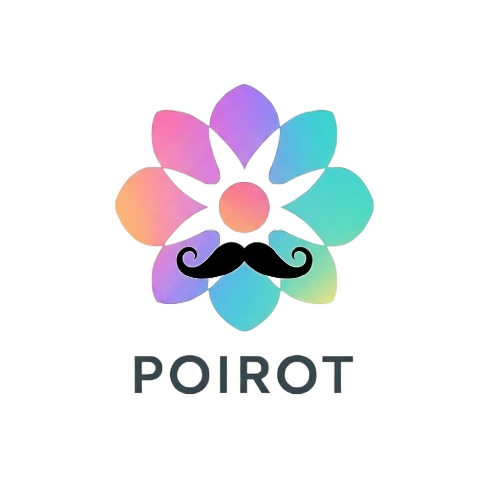

<p align="center">
  
</p>

# POIROT

**Automated forensic analysis for multi-agent AI systems.**

When a multi-agent system produces a wrong, dangerous, or unexpected output, the hardest question is: **which agent caused it?** In a system with multiple agents that all communicated with each other, tracing the root cause manually is slow, error-prone, and often impossible.

POIROT automates that investigation. You give it a description of your system and the conversation history of a failed session. It returns a structured forensic report identifying which component is responsible.

---

> **Preprint:** *(coming soon)*
>
> **Website:** *(coming soon)*
>
> **Documentation wiki:** *(in development — see [docs/wiki/](docs/wiki/) in the meantime)*

---

## How it works

POIROT treats a failed session as a crime scene. It runs 4 sequential phases:

1. **Error Vector Space** — maps all possible failure sources in your system into a binary error space
2. **Individual Analysis** — each agent independently self-assesses its own behavior
3. **Peer Consultation** — agents interrogate each other via a LangGraph multi-agent graph
4. **Weighted Consensus** — votes are aggregated using a consistency-weighted formula to identify the faulty component

The result is an explainable, auditable forensic report — not a black-box prediction.

---

## Installation

```bash
pip install poirot-framework
```

Requires Python 3.10+.

---

## Quickstart

### With a SQLite database (any system, any language)

```python
import poirot

results = poirot.run_poirot(
    database_path="my_system.db",
    system_name="MyAgentSystem",
    system_description="""
        A 3-agent pipeline:
        - PlannerAgent: decomposes the user request into subtasks
        - ExecutorAgent: executes each subtask using tools
        - ReviewerAgent: validates the output before delivery
    """,
    provider="gemini",
    api_key="YOUR_API_KEY",
)

c = results["consensus"]
if c["is_tie"]:
    print(f"TIE between: {', '.join(c['tied_components'])}")
else:
    print(f"Faulty component : {c['faulty_component']}")
print(f"Confidence       : {c['confidence_pct']:.1f}%")
```

### With LangChain agents (direct integration)

```python
from poirot import run_poirot_from_agents, LangChainAgentAdapter

results = run_poirot_from_agents(
    agents=[
        LangChainAgentAdapter(agent=planner, messages=planner_messages, agent_id="planner", agent_name="PlannerAgent"),
        LangChainAgentAdapter(agent=executor, messages=executor_messages, agent_id="executor", agent_name="ExecutorAgent"),
    ],
    system_name="MyAgentSystem",
    system_description="...",
    provider="gemini",
    model="gemini-2.5-pro",
    api_key="YOUR_API_KEY",
)
```

---

## Supported LLM providers

| Provider | `provider=` value |
| --- | --- |
| Google Gemini | `"gemini"` |
| OpenAI | `"openai"` |
| DeepSeek | `"deepseek"` |
| Ollama (local) | `"ollama"` |
| LM Studio (local) | `"local"` |

---

## Reading the results

```python
results = poirot.run_poirot(...)

# Main verdict
c = results["consensus"]
c["faulty_component"]   # "RiskManagerAgent" — or "AgentA / AgentB" if tied
c["confidence_pct"]     # 72.4
c["is_tie"]             # False
c["tied_components"]    # [] or ["AgentA", "AgentB"] when tied

# Per-agent votes
for agent_id, report in results["agent_reports"].items():
    print(report["name"])           # "RiskManagerAgent"
    print(report["vote"])           # [1, 1, 0, 0]
    print(report["justification"])  # full reasoning

# Raw phase outputs for advanced inspection
results["details"]["phase0_error_space"]
results["details"]["phase1_reports"]
results["details"]["phase2_voting"]
```

---

## Key parameters

| Parameter | Default | Description |
| --- | --- | --- |
| `output_dir` | `None` | Directory for result files. `None` = nothing saved |
| `verbose` | `True` | Print protocol progress to terminal |
| `debug` | `False` | Save intermediate LLM context files to `debug/` subfolder |
| `ignore_list` | `None` | Component names to exclude from analysis |

Full parameter reference: [API Reference](docs/wiki/api-reference.md)

---

## Examples

Working examples for both integration modes are in [`examples/`](examples/):

```text
examples/
├── langchain/
│   ├── 01_medical_diagnosis.py
│   ├── 02_stock_trading.py
│   └── 03_web_development.py
└── database/
    ├── 01_medical_diagnosis.py
    ├── 02_stock_trading.py
    └── 03_web_development.py
```

Each example includes a realistic multi-agent scenario with an intentional bug for POIROT to identify.

---

## License

MIT — see [LICENSE](LICENSE).
